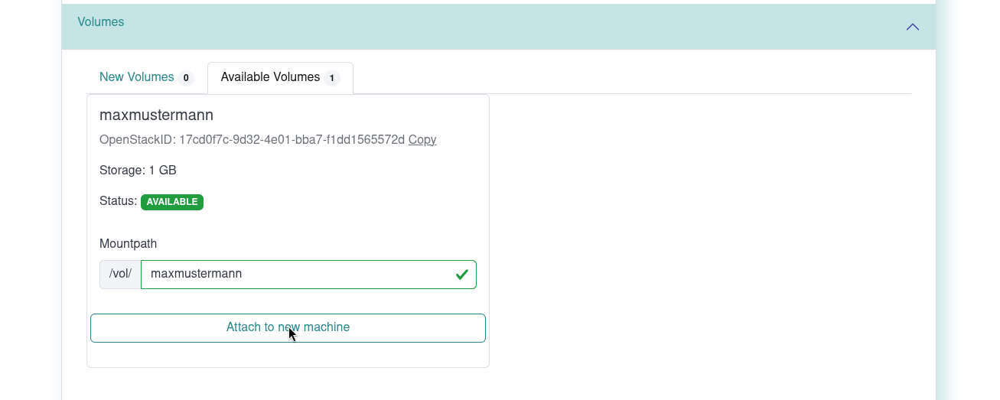

## Section 4: Inspect your generated data via a research environment

We now want to start a new VM. This time we would like to use RStudio 
in order to inspect and visualize our results.

### 5.1 Create a VM based on a Research Environment

1. Start a new VM. Please use again your name without any spaces (e.g. Max Mustermann -> MaxMusterman).
   This time select again the de.NBI default flavor since
   we do not need that much resources anymore.

2. In the image section, please click on the *Research Environments* tab 
   and select the **RStudio** image with OS version **24.04**.
   
3. In the volume tab please click on **Available Volumes** and choose the volume you created
   in the previous part of the workshop.
   Please use again `/vol/data` as mountpath. Click on **Attach to new machine** to add the volume.
   

4. Grant access to the workshop organizers (Peter Belmann, David Weinholz).
   This way the organizers get ssh access to your VM and can help you in case
   something does not work as expected.

5. Click on Start. You will then be redirected to the **Instance Overview** page, where you can set custom tags while
   your VM is being prepared.

6. It will take a few minutes to start the machine. In the instance overview, click on the newly started VM to open the tab.
   Click on 'Rstudio' to see the URL of your research environment. A new tab should open in your browser.

### 4.2 RStudio

1. Login credentials for the RStudio user login are.
   ```
   Username: ubuntu  
   Password: simplevm
   ```

2. In RStudio please open a terminal first by either selecting the `Terminal` tab, or by clicking on
   `Tools` -> `Terminal` -> `New Terminal`.

3. Download the Script by running wget:
   ```
   wget https://openstack.cebitec.uni-bielefeld.de:8080/simplevm-workshop/analyse.Rmd
   ```   
   
4. Further you have to install necessary R libraries. Please switch back
   to the R console:
   
   
   Install the following libraries: 
   ```
   install.packages(c("ggplot2","RColorBrewer","rmarkdown"))
   ```
5. You can now open the `analyse.Rmd` R notebook via `File` -> `Open File`.

6. You can now start the script by clicking on `Run` -> `Restart R and run all chunks`.
  

Back to [Section 3](part3.md) | Next to [Section 5](part51.md)
