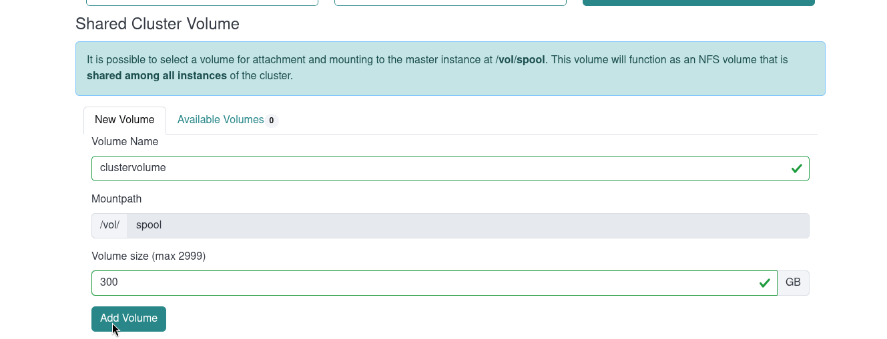
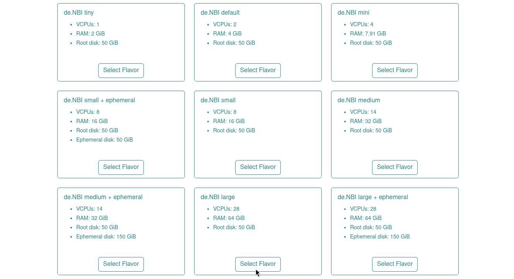
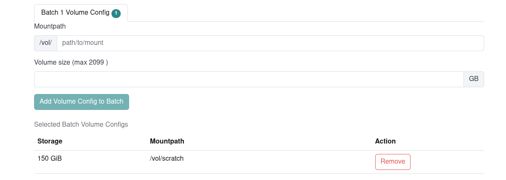

## Section 5 (Part 1):  Scale up your analysis horizontally to further analyze the detected Microbiomes

In this part of the tutorial, you will learn how to scale up your cluster horizontally using a SimpleVM Cluster.
A SimpleVM cluster comprises a master node and multiple worker nodes. A SLURM workload manager
will be installed. SLURM allows you to submit scripts, known as jobs, which are queued up.
When free resources (CPUs, RAM) become available on one of the worker nodes, the script will be executed on that node.
This means that you do not have to check which nodes are free in order to run your jobs.
Next, you will configure a cluster and submit your tools to a SLURM job scheduler.

### 5.1 Create a Cluster

1. Click on "Create new Clusters" on the left menu. Please use again your name without any spaces (e.g. Max Mustermann -> MaxMusterman).

2. Since your master node is just used for submitting jobs, please select *de.NBI medium* as flavor and
   the snapshot **SimpleVMCluster-9302a** as image.
   

3. Every cluster has a shared disk between all worker nodes and the master node. You can create a new volume for the cluster with 300 GB size in the **Shared Cluster Volume** section. 
   Don't forget to click on **Add Volume**.
   

4. The worker nodes will run the actual tools, so we need a flavor with more cores then the one
   that the master node is using. Furthermore, the worker nodes need more disk space since the tools save their intermediate results on the respective worker node. 
   Please select **de.NBI large** as a flavor. 
   
   In the **Batch Volume Config** section specify **/vol/scratch** in the mountpath and 150 GB in the volume size field. Don't forget to click on the **Add Volume Config to Batch** button.
   
   We need three worker nodes so provide a `3` as the worker count.
   

5. Grant access to the workshop organizers (Peter Belmann, David Weinholz).
   This way the organizers get ssh access to your VM and can help you in case
   something does not work as expected.

6. You've just started your own cluster with a few clicks.

Back to [Section 4](part4.md) | Next to [Section 5 (Part 2)](part52.md)
